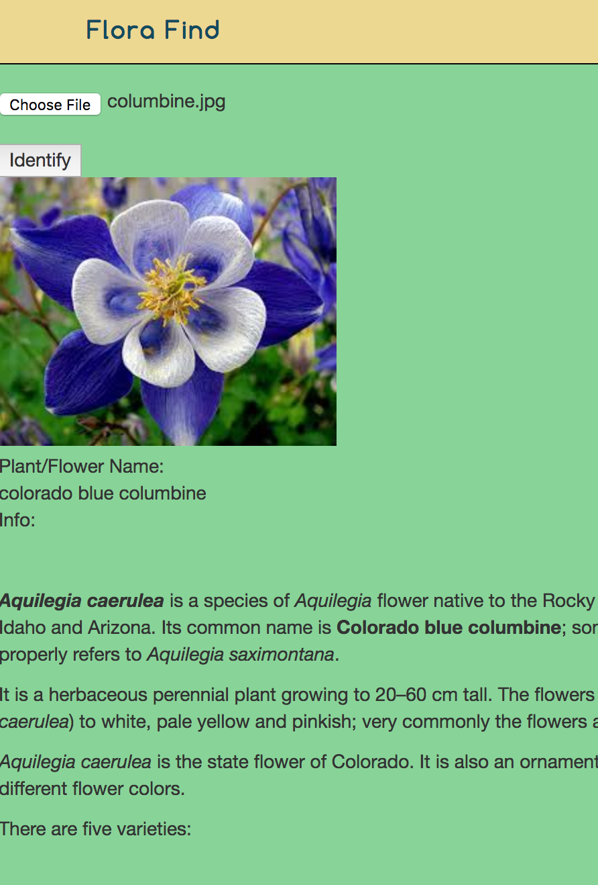

### Flora Find 

**Project status:** Good. I'm 90% at MVP.

The upload photo functionality is working and pulls in the correct data from the API.

It is also able to pull in the Wikipedia info, however since Wikipedia needs the scientific name (which Google doesn't provide) I'm having to hard code the scientific names into the variables. This way it will work on presentation day. 

 

**Current Bugs:**

When uploading a photo from the mobile phone, it rotates it 90°. Will be working on that today.

**To do:**

Make it pretty and designed for mobile first. 

**Stretch goals:**

Create a database with flower name and matching scientific name.

Have a save photo option to save to the Google Cloud. 
